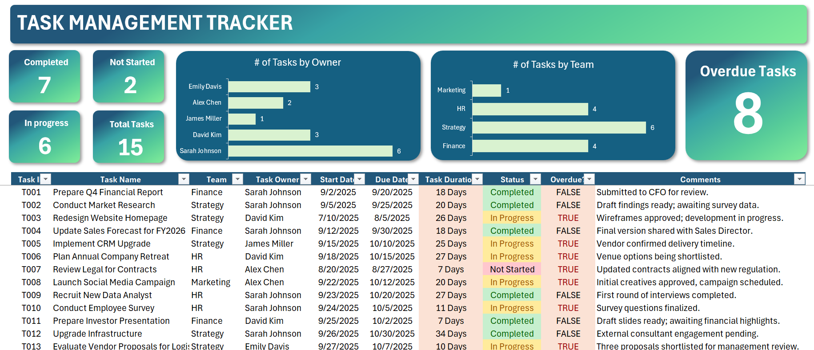

# Dynamic-Task-Management-Tracker-in-Excel


## Overview
This tutorial teaches how to create an interactive task management tracker in Excel with live KPIs that automatically update when new tasks are added. The tracker displays task status distribution, overdue items, and a complete task list with conditional formatting.

The final result is a **Task Management Tracker** built entirely in Excel—no add-ins required.

> Example outputs of the completed tracker.

### Task Management Dshboard



## File Structure

### Required Sheets
1. **Dashboard Sheet**: Contains all tasks and KPIs
2. **Support Sheet**: Contains reference data (employees, teams, status options)

## Step-by-Step Build Process

### 1. Initial Data Setup

#### Converting Data to Table
- Select the data range
- Press **Ctrl+T** to convert to table
- Click OK to confirm

#### Table Formatting Options
- Go to Table Design tab
- Untick "Banded Rows" if preferred
- Choose light formatting option with no background borders
- Remove gridlines: **Alt+W+V+G** (or View > Gridlines)

#### Data Structure
The dashboard table includes these columns:
- Task ID
- Task Name
- Task Owner
- Team
- Start Date
- Due Date
- Task Duration (calculated)
- Status
- Priority
- Overdue (calculated)

### 2. Calculated Columns

#### Task Duration Formula
Calculates the number of days between start and due dates:
```excel
=[Due Date] - [Start Date]
```

**Custom Number Formatting:**
- Select the duration column (Ctrl+Shift+Down Arrow)
- Press **Ctrl+1** to open Format Cells
- Custom format: `# "days"`
- This displays "18 days" instead of just "18"

#### Overdue Column Formula
Uses the AND function to check two conditions:
```excel
=AND([@Status]<>"Completed", [@[Due Date]]<TODAY())
```

**Logic:**
- First condition: Task status is NOT "Completed"
- Second condition: Due date is less than today's date
- Returns TRUE if both conditions are met, FALSE otherwise
- The TODAY() function updates automatically when the file is opened

### 3. Future-Proofing with Data Validation

#### Purpose
Prevents data entry errors and ensures consistency (e.g., preventing "Emily" vs "Emily Davis" entries)

#### Setting Up Data Validation for Task Owner
1. Select all Task Owner cells
2. Go to Data > Data Validation
3. Settings:
   - Allow: List
   - Source: Click the range selector button
   - Navigate to Support sheet
   - Select all employee names in the owners list
   - Click OK

**Result:** Users can only select from predefined names via dropdown, preventing typos and inconsistencies

#### Apply Same Validation to Other Columns
- **Team column**: Validate against team list in Support sheet
- **Status column**: Validate against status options (Completed, In Progress, Not Started)

### 4. Preparing the Dashboard Layout

#### Moving Data Down
- Select all task data
- Press **Ctrl+X** to cut
- Click on cell A14 (or desired starting row)
- Press **Ctrl+V** to paste
- This creates space at the top for KPIs (rows 1-13)

### 5. Creating KPI Shapes

#### Creating the Gradient Shape (in Support Sheet)
1. Insert a shape (Insert > Shapes > Rectangle)
2. Right-click > Format Shape
3. Fill section: Select "Gradient fill" instead of "Solid fill"
4. Gradient stops: Choose colors for the gradient
5. Adjust gradient stop positions to control where colors transition
6. Save this shape as a template for copying

#### Adding KPI Shapes to Dashboard
1. Copy the gradient shape from Support sheet
2. Paste in Dashboard sheet
3. Stretch it across the top for the title
4. Add text: "Task Management Tracker"
5. Center the text and increase font size

#### Duplicating Shapes for KPIs
- Press **Ctrl+D** to duplicate shapes
- Resize and position for different KPI areas
- Hold **Ctrl+Shift** while dragging to maintain alignment
- Create shapes for:
  - Task status counts (Completed, In Progress, Not Started)
  - Total tasks
  - Distribution by owner (bar chart)
  - Distribution by team (bar chart)
  - Overdue tasks

**Color Customization:**
- Select shape
- Change fill color in the formatting options
- For middle sections: Use dark blue color

### 6. Calculating KPI Values (in Support Sheet)

#### Task Status Counts

**Status List:**
- Completed
- In Progress
- Not Started
- Total

**Completed Count Formula:**
```excel
=COUNTIF(Dashboard!$E:$E, "Completed")
```
Where column E contains the Status data

**In Progress Count Formula:**
```excel
=COUNTIF(Dashboard!$E:$E, "In Progress")
```

**Not Started Count Formula:**
```excel
=COUNTIF(Dashboard!$E:$E, "Not Started")
```

**Total Tasks Formula:**
```excel
=SUM(C3:C5)
```
Where C3:C5 contains the three status counts

#### Task Distribution by Owner

**Count by Owner Formula:**
```excel
=COUNTIF(Dashboard!$C:$C, A2)
```
Where:
- Column C in Dashboard contains Task Owner data
- A2 contains the specific owner name (Sara, David, Emily, Mike)
- Drag formula down for all owners

#### Task Distribution by Team

**Count by Team Formula:**
```excel
=COUNTIF(Dashboard!$D:$D, A2)
```
Where:
- Column D in Dashboard contains Team data
- A2 contains the specific team name (Finance, Marketing, HR, IT)
- Drag formula down for all teams

#### Overdue Tasks Count

**Overdue Count Formula:**
```excel
=COUNTIF(Dashboard!$J:$J, TRUE)
```
Where column J contains the Overdue calculated values

### 7. Adding KPI Values to Dashboard

#### Creating Text Boxes for KPI Values

**Step 1: Insert Text Box**
1. Go to Insert > Shapes > Text Box
2. Draw text box for label (e.g., "Completed")
3. Format the text box:
   - Shape Format > Shape Fill > No Fill
   - Shape Format > Shape Outline > No Outline
   - Change text color to white
   - Increase font size

**Step 2: Create Value Text Box**
1. Press **Ctrl+D** to duplicate the label text box
2. Delete the text inside
3. Click in the formula bar
4. Type `=` and navigate to Support sheet
5. Click on the calculated value (e.g., C3 for Completed count)
6. Press Enter

**Step 3: Format the Value**
- Use Format Painter from the label text box to copy formatting
- Adjust font size as needed (make it larger for visibility)
- Position the value below or beside the label

**Step 4: Duplicate for Other Status Counts**
- Press **Ctrl+Shift** and drag to create copies
- Update each text box to link to the correct cell:
  - Completed: `=Support!C3`
  - In Progress: `=Support!C4`
  - Not Started: `=Support!C5`
  - Total: `=Support!C6`

### 8. Creating Bar Charts for Distribution

#### Distribution by Owner Chart

**Step 1: Create the Chart**
1. In Support sheet, select owner names and their counts
2. Go to Insert > Charts
3. Choose 2D Bar Chart (horizontal bars)

**Step 2: Format the Chart**
1. Remove gridlines
2. Remove bottom axis
3. Add data labels (on the edge of bars)
4. Change bar color:
   - Select bars > Format > Shape Fill > Light color (for visibility on dark background)
5. Chart area formatting:
   - Select chart area > Shape Fill > No Fill
   - Shape Outline > No Outline
6. Change background to white

**Step 3: Adjust Bar Thickness**
1. Right-click on bars > Format Data Series
2. Reduce Gap Width (try 70-100)
3. Lower gap width = thicker bars

**Step 4: Move to Dashboard**
1. Select chart
2. Press **Ctrl+X** to cut
3. Go to Dashboard sheet
4. Press **Ctrl+V** to paste
5. Position over the designated KPI shape
6. Adjust size to fit
7. Update chart title if needed

#### Distribution by Team Chart
Follow the same process as Distribution by Owner:
1. Select team data in Support sheet
2. Insert 2D Bar Chart
3. Apply same formatting
4. Cut and paste to Dashboard
5. Position appropriately

### 9. Overdue Tasks KPI

#### Creating the Overdue Display
1. Copy existing text boxes from another KPI section
2. Press **Ctrl+Shift** and drag to move
3. Update label text to "Overdue"
4. Update value text box formula:
```excel
=Support![Overdue Count Cell]
```
5. Make the number large and prominent
6. Use Format Painter to maintain consistent styling

### 10. Improving User Interface

#### Freeze Panes for Scrolling
**Purpose:** Keep KPIs visible while scrolling through task list

**Steps:**
1. Click on cell A15 (first row below KPIs)
2. Go to View > Freeze Panes > Freeze Panes
3. Result: Top section stays visible when scrolling down

#### Conditional Formatting for Status

**Completed Tasks (Green):**
1. Select Status column (Ctrl+Shift+Down to select all)
2. Go to Home > Conditional Formatting
3. Highlight Cell Rules > Equal To
4. Enter "Completed"
5. Choose Green Fill with Dark Green Text
6. Click OK

**In Progress Tasks (Yellow):**
1. With same range selected
2. Home > Conditional Formatting
3. Highlight Cell Rules > Equal To
4. Enter "In Progress"
5. Choose Yellow Fill with Dark Yellow Text
6. Click OK

**Not Started Tasks (Red):**
1. With same range selected
2. Home > Conditional Formatting
3. Highlight Cell Rules > Equal To
4. Enter "Not Started"
5. Choose Red Fill with Dark Red Text
6. Click OK

#### Conditional Formatting for Overdue

**Overdue Tasks (Red Highlight):**
1. Select Overdue column
2. Home > Conditional Formatting
3. Highlight Cell Rules > Equal To
4. Enter "TRUE"
5. Choose Red Fill
6. Click OK

### 11. Dynamic Updates and Testing

#### How the Tracker Updates Automatically

**When Adding New Tasks:**
1. Type new Task ID in the next row (e.g., "016")
2. Because data is in a table, formulas automatically extend
3. All calculated columns auto-populate
4. KPI counts update immediately
5. Conditional formatting applies automatically

**Example Workflow:**
1. Enter Task ID: 016
2. Copy/paste dates from existing tasks
3. Select Task Owner from dropdown (data validation)
4. Select Team from dropdown
5. Select Status from dropdown
6. Duration calculates automatically
7. Overdue status calculates automatically
8. All KPIs refresh automatically

**Deleting Tasks:**
- Select row
- Press **Ctrl+Minus**
- Row deletes and KPIs update automatically

#### Testing Dynamic Updates
1. Add a new task with owner "David Kim"
2. Observe that David Kim's count in the bar chart increases
3. Change status to "Completed"
4. Watch conditional formatting change to green
5. Observe total completed count increase in KPI
6. Delete the test row
7. All values return to original state

## Key Excel Functions Used

### Data Validation
- Creates dropdown lists for consistent data entry
- Prevents typos and variations in names

### Formulas
```excel
# Task Duration
=[Due Date] - [Start Date]

# Overdue Status
=AND([@Status]<>"Completed", [@[Due Date]]<TODAY())

# Count Completed
=COUNTIF(Dashboard!$E:$E, "Completed")

# Count by Owner
=COUNTIF(Dashboard!$C:$C, [Owner Name])

# Count by Team
=COUNTIF(Dashboard!$D:$D, [Team Name])

# Count Overdue
=COUNTIF(Dashboard!$J:$J, TRUE)

# Total Tasks
=SUM([Status Count Range])
```

### Shortcuts Used
- **Ctrl+T**: Convert to table
- **Ctrl+1**: Format Cells dialog
- **Ctrl+D**: Duplicate object
- **Ctrl+X**: Cut
- **Ctrl+V**: Paste
- **Ctrl+Minus**: Delete row
- **Ctrl+Shift+Down**: Select to bottom of data
- **Ctrl+Shift+Drag**: Move/copy while maintaining alignment
- **Alt+W+V+G**: Toggle gridlines

## Design Best Practices

### Visual Hierarchy
1. **Large title** at top for immediate context
2. **Key metrics** prominently displayed with large numbers
3. **Supporting visuals** (bar charts) for deeper insight
4. **Detailed data** below in table format

### Color Coding
- **Green**: Completed tasks (positive)
- **Yellow**: In Progress tasks (neutral)
- **Red**: Not Started and Overdue tasks (attention needed)
- **Dark blue**: Chart backgrounds for contrast
- **White text**: On dark backgrounds for readability

### Gradient Shapes
- Create visual interest
- Professional appearance
- Can be customized to match brand colors
- Reusable across multiple KPIs

### Data Validation
- Prevents errors before they happen
- Ensures data consistency
- Makes data entry faster with dropdowns
- Reduces need for data cleaning

## Automatic Features

### What Updates Automatically:
1. **KPI counts** when tasks are added/removed
2. **Task duration** when dates are entered
3. **Overdue status** based on TODAY() function
4. **Conditional formatting** when status changes
5. **Bar charts** when distribution changes
6. **Table formulas** when new rows are added

### What Requires Manual Refresh:
- None! Everything is formula-based and live

## Optional Enhancements Not Covered

### Navigation Bar
- Can be added on the side
- Use hyperlinks to navigate between sheets
- Use same brand colors for consistency

### Additional Features to Consider:
- Priority-based color coding
- Task completion percentage tracker
- Timeline/Gantt chart view
- Filters for viewing specific teams/owners
- Search functionality
- Archive for completed tasks
- Automated email reminders (with VBA/Power Automate)

## Maintenance Tips

### Adding New Employees
1. Add name to Support sheet employee list
2. Data validation automatically includes new names
3. Bar chart will expand when new person is assigned tasks

### Adding New Teams
1. Add team to Support sheet team list
2. Data validation automatically includes new team
3. Bar chart will expand when new team gets tasks

### Adding New Status Options
1. Add status to Support sheet status list
2. Update data validation
3. Add new COUNTIF formula in Support sheet
4. Create new conditional formatting rule
5. Update KPI display

### File Maintenance
- Regularly archive completed tasks to new sheet
- Keep Support sheet organized
- Document any formula changes
- Test new features before rolling out to users

## Common Issues and Solutions

### Issue: KPIs Not Updating
**Solution:** Ensure formulas reference the correct columns and sheets

### Issue: Dropdowns Not Showing All Options
**Solution:** Check data validation source range includes all items

### Issue: Dates Showing as Numbers
**Solution:** Format cells as Date (Ctrl+1 > Date)

### Issue: Conditional Formatting Not Applying to New Rows
**Solution:** Ensure the table extends automatically or reapply formatting to expanded range

### Issue: Charts Not Updating
**Solution:** Verify chart data source includes the calculation cells

---

*This task management tracker provides a professional, automatically updating solution for tracking team tasks with minimal manual effort. All metrics update in real-time as tasks are added, modified, or completed.*
